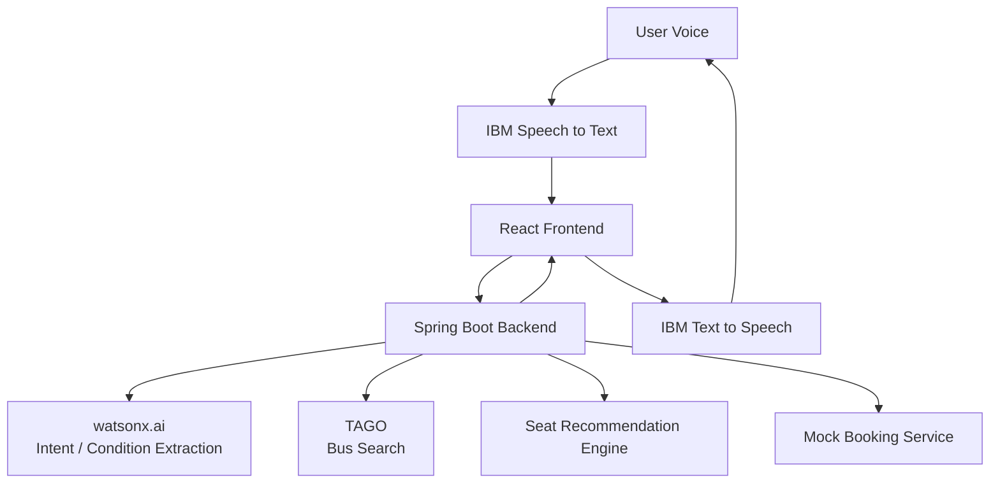

<aside>
🚌

# **말로타 (Malrota)**

**말로 타는 고속버스**

Voice-first accessible intercity bus booking assistant for older adults and digitally vulnerable users.

말로타는 고령자 및 디지털 취약계층이 복잡한 예매 화면을 직접 탐색하지 않아도 자연어 음성으로 고속버스를 검색하고, 사용자 상황에 맞는 좌석을 추천받아 예매 과정까지 진행할 수 있도록 돕는 AI 기반 서비스입니다.

</aside>

## 1. Project Overview

기존 고속버스 예매 서비스는 출발지, 목적지, 날짜, 시간, 버스, 좌석 등을 여러 화면에서 사용자가 직접 선택해야 합니다. 말로타는 이 과정을 **폼 기반 예매에서 대화 기반 예매로 전환**합니다.

> "내일 오전에 서울에서 대전 가려고 하는데 다리가 불편해서 앞쪽 창가 자리로 잡아줘."
> 

AI는 발화에서 출발지·도착지·날짜·시간대·좌석 선호·접근성 요구를 추출하고, 실제 운행정보와 추천 규칙을 결합해 사용자가 선택할 수 있는 결과를 제공합니다.

### 핵심 목표

- 복잡한 예매 UI 탐색 최소화
- 음성 중심의 자연스러운 예매 경험
- 고령자 및 디지털 취약계층을 고려한 접근성 UX
- 사용자의 신체적 상황과 선호를 반영한 좌석 추천
- AI가 임의로 거래를 확정하지 않고 **최종 확인 후 예매**하는 안전한 흐름

## 2. Target User

- 스마트폰 및 모바일 예매 서비스 사용에 어려움을 느끼는 고령자
- 복잡한 화면 이동이나 작은 UI 조작이 어려운 사용자
- 이동에 불편이 있어 좌석 위치를 고려해야 하는 사용자
- 음성으로 빠르게 교통편을 검색하고 싶은 사용자

## 3. Core Features

- 🎙️ 음성 기반 고속버스 검색
- 💬 자연어 기반 예매 조건 추출
- 🚌 실제 고속버스 운행정보 조회
- 🪑 사용자 상황에 맞춘 좌석 추천
- 👴 고령자 친화적 대형 UI
- 🔊 STT/TTS 기반 음성 입출력
- ✅ 결제·예매 전 최종 확인 단계
- 🧠 IBM watsonx.ai 기반 의도 및 조건 분석

## 4. MVP Scope

### MVP 포함

- 음성 입력 → STT
- 자연어 조건 분석
- 출발지 / 도착지 / 날짜 / 시간대 추출
- 좌석 선호 / 접근성 요구 추출
- TAGO 기반 실제 운행정보 검색
- 규칙 기반 좌석 추천
- 추천 이유 표시
- 사용자 최종 확인
- Mock 좌석 / Mock 예매
- TTS 결과 안내

### MVP 제외

- 실제 결제
- 실제 좌석 선점
- 실제 티켓 발권
- 실제 예매 사업자 계정 연동
- 복잡한 회원/마이페이지 기능

<aside>
⚠️

**실서비스 확장 시 핵심 제약**

TAGO 공개 API는 운행정보 조회에는 사용할 수 있지만 실제 잔여좌석·좌석 선점·결제·발권까지 제공하지 않습니다. 해커톤에서는 Mock Booking으로 구현하고, 실서비스 단계에서는 예매 사업자와의 공식 제휴 API를 검토합니다.

</aside>

## 5. User Flow

```
Voice Input
   ↓
Speech to Text
   ↓
Natural Language Parsing
   ↓
Missing Information Check
   ↓
Bus Search (TAGO)
   ↓
Seat Recommendation
   ↓
Confirmation UI
   ↓
Mock Booking
   ↓
Voice Confirmation
```

### 예외 흐름

사용자의 발화에 필수 조건이 빠져 있으면 AI가 임의로 추정하지 않고 추가 질문을 합니다.

```
User: "내일 서울 가는 버스 찾아줘."
System: "어디에서 출발하시나요?"
```

## 6. AI Structured Output

자연어 모델은 직접 좌석이나 예매 결과를 결정하지 않고 **사용자의 의도와 조건을 구조화**하는 역할을 우선합니다.

```json
{
  "intent": "BUS_SEARCH",
  "departure": "서울",
  "arrival": "대전",
  "date": "2026-08-23",
  "timePreference": "MORNING",
  "passengers": 1,
  "seatPreferences": ["FRONT", "WINDOW"],
  "accessibilityNeeds": ["WALKING_DIFFICULTY"]
}
```

### 필수 조건

- departure
- arrival
- date

### 선택 조건

- timePreference
- passengers
- seatPreferences
- accessibilityNeeds

필수 조건이 누락된 경우 `missingFields`를 반환하고 대화를 통해 보완합니다.

## 7. Seat Recommendation Policy

좌석 추천은 LLM이 임의로 결정하지 않고 **규칙 기반 Recommendation Engine**에서 수행합니다.

| 사용자 표현 / 조건 | 추천 기준 |
| --- | --- |
| 창밖을 보고 싶어요 | Window 우선 |
| 멀미가 심해요 | Front 우선 |
| 다리가 불편해요 | Front / 접근성 우선 |
| 옆에 사람이 없는 자리가 좋아요 | Solo-friendly 우선 |
| 같이 앉고 싶어요 | Adjacent seats 우선 |
| 통로 쪽이 편해요 | Aisle 우선 |

추천 결과에는 가능하면 **추천 이유**를 함께 제공합니다.

> "다리가 불편하다고 말씀하셔서 출입구 접근이 쉬운 앞쪽 좌석을 우선 추천했습니다."
> 

## 8. Tech Stack

### Frontend

- React
- Responsive Web UI
- IBM Speech integration (STT/TTS)

### Backend

- **Java 17**
- **Spring Boot**
- Spring Web
- REST API
- Bean Validation
- 필요 시 Spring Data JPA / DB는 MVP 이후 도입

### AI

- IBM watsonx.ai
- IBM Speech to Text
- IBM Text to Speech

### External Data

- 국토교통부 TAGO 고속버스 운행정보 API
- Mock Seat API
- Mock Booking API

## 9. Architecture



### Backend Responsibility

Spring Boot는 단순 API 중계가 아니라 서비스의 상태와 도메인 로직을 담당합니다.

- 대화에서 추출된 조건 검증
- TAGO 운행정보 조회
- 좌석 추천 규칙 실행
- 사용자 확인 상태 관리
- Mock 예매 처리
- 외부 API 오류/Timeout 처리
- 향후 실제 예약·결제 연동의 확장 지점 제공

## 10. Backend Package Draft

```
backend/
└─ src/main/java/.../malrota/
   ├─ controller/
   │  ├─ ConversationController.java
   │  ├─ BusController.java
   │  └─ BookingController.java
   ├─ service/
   │  ├─ ConversationService.java
   │  ├─ BusService.java
   │  ├─ SeatRecommendationService.java
   │  └─ BookingService.java
   ├─ client/
   │  ├─ TagoClient.java
   │  └─ WatsonxClient.java
   ├─ dto/
   │  ├─ request/
   │  └─ response/
   ├─ domain/
   ├─ exception/
   └─ config/
```

## 11. API Draft

### `POST /api/conversation/parse`

사용자의 STT 결과를 구조화된 예매 조건으로 변환합니다.

**Request**

```json
{
  "text": "내일 오전 서울에서 대전 가는데 다리가 불편하고 창가가 좋아요"
}
```

**Response**

```json
{
  "intent": "BUS_SEARCH",
  "departure": "서울",
  "arrival": "대전",
  "date": "2026-08-23",
  "timePreference": "MORNING",
  "seatPreferences": ["WINDOW"],
  "accessibilityNeeds": ["WALKING_DIFFICULTY"],
  "missingFields": []
}
```

### `POST /api/buses/search`

구조화된 조건을 기준으로 운행편을 검색합니다.

### `POST /api/seats/recommend`

사용자 선호와 접근성 조건을 기준으로 Mock 좌석 중 추천 좌석을 반환합니다.

### `POST /api/bookings/confirm`

사용자가 최종 확인한 Mock 예매를 생성합니다.

<aside>
💡

API Request/Response 필드는 프론트엔드와 AI 출력 스키마가 확정되면서 세부 조정합니다. 프론트엔드는 백엔드 내부 구현을 몰라도 API 계약만으로 병렬 개발할 수 있도록 합니다.

</aside>

## 12. Development Principles

- AI 출력은 반드시 서버에서 검증합니다.
- 날짜·터미널·운행편 등 실제 데이터는 LLM의 기억에 의존하지 않습니다.
- 사용자가 말하지 않은 필수 예매 조건을 임의로 확정하지 않습니다.
- 접근성 요구는 추천에 사용하되 불필요한 개인정보로 저장하지 않습니다.
- 실제 결제/예매 전에는 반드시 사용자에게 최종 조건을 명확히 보여줍니다.
- 외부 API Key와 인증정보는 환경변수로 관리하고 저장소에 Commit하지 않습니다.

## 13. Error Handling

| 상황 | 처리 |
| --- | --- |
| 출발지/도착지 누락 | 추가 질문 |
| 날짜 누락 | 추가 질문 |
| 존재하지 않는 터미널 | 가까운 후보 또는 재입력 요청 |
| 조건에 맞는 버스 없음 | 인접 시간대 제안 |
| TAGO 오류 | 재시도 또는 조회 실패 안내 |
| AI 응답 파싱 실패 | 재요청 / 안전한 기본 오류 응답 |
| 예매 조건 변경 | 확인 상태 초기화 후 재확인 |

## 14. Security / Privacy

- API Key는 `.env` 또는 서버 환경변수에서 관리
- Repository에 Key / Password / Token Commit 금지
- 로그에 민감한 사용자 발화가 불필요하게 남지 않도록 관리
- 외부 AI 서비스에 전달하는 정보 최소화
- 향후 회원 기능 도입 시 인증/인가 별도 설계

## 15. MVP Success Criteria

- 사용자가 음성으로 출발지·도착지·날짜를 전달할 수 있다.
- 시스템이 자연어에서 예매 조건을 구조화할 수 있다.
- 부족한 필수 조건을 추가 질문으로 보완할 수 있다.
- 실제 TAGO 운행정보를 조회할 수 있다.
- 접근성/좌석 선호를 바탕으로 Mock 좌석을 추천할 수 있다.
- 추천 이유를 사용자에게 설명할 수 있다.
- 최종 확인 이후 Mock 예매가 완료된다.
- 전체 과정의 주요 안내를 음성으로 받을 수 있다.

## 16. Future Expansion

### Phase 2

- 사용자 선호 저장
- 최근 검색 / 예매 내역
- 자주 이용하는 출발지
- 접근성 프로필 선택 저장
- 다국어 음성 지원

### Phase 3

- 실제 잔여좌석 연동
- 예매 사업자 공식 API 제휴
- 실제 좌석 선점
- PG 결제
- 발권 / 취소 / 환불
- 고속버스 외 철도·시외버스 등 교통수단 확장

## 17. Open Questions

- STT/TTS를 프론트에서 직접 호출할지 백엔드를 경유할지
- watsonx.ai 호출 책임을 어느 계층에 둘지
- 대화 상태를 프론트/백엔드 중 어디에서 유지할지
- Mock 좌석 배치 데이터를 어떤 형식으로 정의할지
- TAGO 터미널명과 사용자 자연어 지명 매핑 정책
- 시간 표현(아침/오전/점심/저녁)의 범위 정의
- 접근성 추천 규칙의 우선순위 및 충돌 처리
- 해커톤 이후 실서비스 확장 여부

WorkingList

## 18. Hackathon Schedule — 8/22 → 8/26

<aside>
⏱️

**목표: 8월 26일 수요일 Demo Ready**

기간이 짧으므로 모든 P0 작업은 완성도보다 **E2E 시연 가능 여부**를 우선합니다. 화요일 밤까지 기능 연결을 끝내고 수요일은 신규 기능 개발이 아니라 QA·배포·리허설에 사용합니다.

</aside>

| 날짜 | 마일스톤 | 핵심 목표 | 종료 조건 |
| --- | --- | --- | --- |
| 8/22 토 | M0 기획·환경 | MVP/API 계약 확정, 개발 착수 | 범위 동결 및 FE/BE 구조 확정 |
| 8/23 일 | M0 → M1 | 화면 플로우, Spring/React 기반, AI·TAGO 착수 | 각 파트가 독립 개발 가능한 상태 |
| 8/24 월 | M1 Core API | AI, STT/TTS, TAGO, 좌석추천, Mock Booking | 핵심 기능을 각각 단독 호출 가능 |
| 8/25 화 | M2 E2E + M3 | FE↔BE↔AI 연결 및 통합 테스트 | 음성→검색→추천→예매 1회 완주 |
| 8/26 수 | M3 → M4 | 버그 수정, 배포, 접근성 QA, 발표 리허설 | 3~5분 데모 2회 연속 성공 |

### 일정 운영 원칙

- **8/24 월요일 밤:** Core API Freeze. 이후 API 구조의 큰 변경 금지.
- **8/25 화요일 오후:** Feature Freeze. 새로운 기능 추가 금지.
- **8/25 화요일 밤:** E2E 시연이 안 되는 P1/P2 기능은 즉시 제외.
- **8/26 수요일:** 버그 수정·배포·리허설만 수행.
- 실제 좌석/결제/발권은 이번 일정에서 구현하지 않습니다.
- TAGO 또는 AI 외부 API 장애를 대비해 데모용 Mock/Fallback 데이터를 준비합니다.

### Critical Path

```
API 계약 확정
   ↓
Spring / React 기본환경
   ↓
watsonx 조건 추출 + TAGO 조회
   ↓
좌석 추천 + Mock Booking
   ↓
FE API 연결
   ↓
E2E Test
   ↓
Deploy
   ↓
Demo Rehearsal
```

**Critical Path 작업이 지연되면 디자인 디테일이나 P1/P2를 먼저 줄이고 핵심 흐름은 유지합니다.**

**이번 목표는 상용 서비스가 아니라 해커톤 MVP다**. 실제 결제·실좌석 선점·실발권은 하지 않고 Mock으로 끝낸다. 새로운 기능 아이디어가 생겨도 P0 완료 전에는 넣지 않는다.
**API 계약을 임의로 바꾸지 않는다.** Request/Response 필드명이나 타입을 바꿔야 하면 FE/BE/AI 담당끼리 먼저 공유한다. “내 쪽에서 편하니까 바꿈” 금지.
**AI가 모든 걸 결정하게 만들지 않는다**. AI는 자연어에서 조건을 추출하는 역할 위주. 실제 운행정보는 TAGO, 좌석 추천은 규칙 기반 로직으로 처리한다.
**사용자가 말하지 않은 값을 AI가 추측해서 확정하면 안 된다.** 출발지·도착지·날짜 같은 필수값이 없으면 추가 질문으로 받아야 한다.
**날짜/시간 표현을 특히 조심한다.** 내일, 모레, 아침, 오후쯤 같은 표현은 기준 시각을 받아 명시적인 값으로 변환하고, 애매하면 질문한다.
**터미널명 ≠ 도시명일 수 있다.** “서울”, “전주” 같은 자연어를 TAGO 터미널 코드로 바로 박지 말고 매핑 계층을 둔다.
**Mock 데이터와 실제 데이터를 섞지 않는다.** 운행편은 TAGO 실제 데이터, 좌석/예매는 Mock이라는 걸 코드·UI 양쪽에서 구분한다.
**외부 API 실패는 반드시 정상 시나리오로 취급한다.** watsonx/TAGO/STT가 실패하거나 느릴 수 있으니 로딩·재시도·오류 안내가 있어야 한다.
**API Key 절대 GitHub에 올리지 않는다.** .env, application-local.yml 등으로 분리하고 .gitignore 확인. 키가 한번 올라가면 즉시 폐기·재발급.
**접근성 서비스라는 걸 잊지 않는다.** 작은 버튼, 낮은 대비, 음성만 제공하는 UX는 피하고 텍스트 확인 수단도 항상 같이 제공한다.
**예매 최종 확인은 생략하지 않는다.** 출발지/도착지/날짜/시간/버스/좌석/금액 등을 보여주고 사용자가 명시적으로 확인한 뒤 Mock 예매한다.
**개인정보는 필요 이상 저장하지 않는다.** “다리가 불편해요” 같은 접근성 발화는 추천에 필요한 동안만 쓰고, MVP에서는 굳이 DB에 영구 저장하지 않는 방향.
**브랜치 하나에 기능 하나.** main 직접 push 금지. 작업 시작 전 최신 main 반영하고 PR로 합친다. README에도 이미 이 규칙이 잡혀 있다.
**화요일 Feature Freeze 이후 신규 기능 금지.** 수요일은 “더 만들기”가 아니라 안 깨지게 만들기 + 데모 리허설에 쓴다.
**데모 성공 경로를 최우선으로 유지한다.** 가장 중요한 시나리오는 “음성 → 조건추출 → 실제 운행조회 → 좌석추천 → 확인 → Mock 예매 → 음성안내” 한 줄이 처음부터 끝까지 끊기지 않는 것. README의 MVP 흐름도 이 구조다.

**각자 기능을 완성하는 게 목표가 아니라, 수요일에 하나의 사용자 흐름이 처음부터 끝까지 돌아가는 게 목표**
